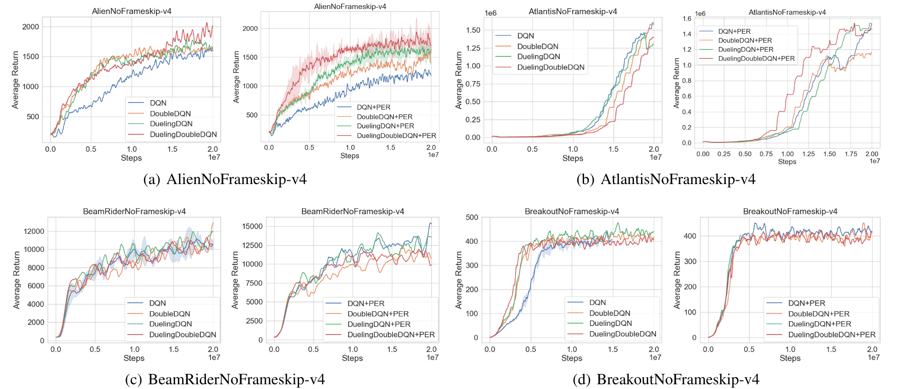
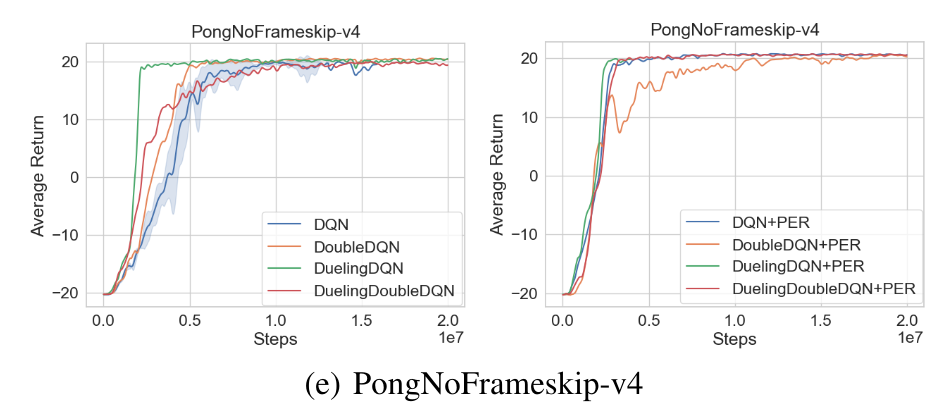

## LWDRLD: LightWeight Deep Reinforcement Learning libraray for Discrete control
Modularized implementation of popular deep RL algorithms in PyTorch. **LWDRLD** is a deep reinforcement learning (RL) library which is inspired by some other deep RL code bases (i.e., [Kchu/DeepRL_PyTorch](https://github.com/Kchu/DeepRL_PyTorch), [openai/baselines](https://github.com/openai/baselines), and [ShangtongZhang/DeepRL](https://github.com/ShangtongZhang/DeepRL)).

These algorithms will make it easier for the research community to replicate, refine, and identify new ideas. Our implementation of state-of-the-art algorithms is roughly on par with the scores in published papers.

### Supported algorithms
| algorithm | Discrete Control | Value-based | Policy-based
|:-|:-:|:-:|:-:|
| [Deep Q-Learning (DQN)](https://www.nature.com/articles/nature14236) | :white_check_mark: | :white_check_mark:|:no_entry:|
| [Double DQN](https://arxiv.org/abs/1509.06461) | :white_check_mark: | :white_check_mark: | :no_entry:|
| [Dueling DQN](https://arxiv.org/abs/1511.06581) | :white_check_mark: | :white_check_mark: | :no_entry:|
| [Prioritized Experience Replay (PER)](https://arxiv.org/abs/1511.05952) | :white_check_mark: | :white_check_mark: |:no_entry:|
### TODO: Waiting to be implemented...
- [ ] N-Step DQN
- [ ] Proximal Policy Optimization (PPO) for Discrete Control
- [ ] Advantage Actor-Critic (A2C)
- [ ] Discrete Soft Actor-Critic (SAC)

## Instructions
### Recommend: Run with Docker
```bash
# python        3.6    (apt)
# pytorch       1.4.0  (pip)
# tensorflow    1.14.0 (pip)
# DMC Control Suite
# MuJoCo
# Atari
# Attention: Our dockerfile needs `mjkey.txt`!! If you just want to run the Atari env, you can change `Dockerfile` and make your customization.
cd dockerfiles
docker build . -t lwdrld
```
For other dockerfiles, you can go to [RL Dockefiles](https://github.com/LQNew/Dockerfiles).

### Launch experiments
```bash
# eg.
# ============== DQN
CUDA_VISIBLE_DEVICES=0 python main.py --policy "DQN" --env "Pong" --seed 0 --exp_name DQN-PongNoFrameskip-v4  # env_name: PongNoFrameskip-v4, algorithm: DQN, CUDA_Num : 0, seed: 0
# ============== Double DQN
CUDA_VISIBLE_DEVICES=0 python main.py --policy "Double_DQN" --env "Pong" --seed 0 --exp_name Double_DQN-PongNoFrameskip-v4
# ============== Dueling DQN
CUDA_VISIBLE_DEVICES=0 python main.py --policy "Dueling_DQN" --env "Breakout" --seed 0 --exp_name Dueling_DQN-BreakoutNoFrameskip-v4
# ============== Dueling Double DQN
CUDA_VISIBLE_DEVICES=0 python main.py --policy "Dueling_Double_DQN" --env "Pong" --seed 0 --exp_name Dueling_Double_DQN-PongNoFrameskip-v4
# ============== DQN + PER
CUDA_VISIBLE_DEVICES=0 python main_per.py --policy "DQN_per" --env "Atlantis" --seed 0 --exp_name DQN_per-AtlantisNoFrameskip-v4
# ============== Double DQN + PER
CUDA_VISIBLE_DEVICES=0 python main_per.py --policy "Double_DQN_per" --env "Pong" --seed 0 --exp_name Double_DQN_per-PongNoFrameskip-v4
# ============== Dueling DQN + PER
CUDA_VISIBLE_DEVICES=0 python main_per.py --policy "Dueling_DQN_per" --env "Alien" --seed 0 --exp_name Dueling_DQN_per-AlienNoFrameskip-v4
# ============== Dueling Double DQN + PER
CUDA_VISIBLE_DEVICES=0 python main_per.py --policy "Dueling_Double_DQN_per" --env "Atlantis" --seed 0 --exp_name Dueling_Double_DQN_per-AtlantisNoFrameskip-v4
```

### Plot results
```bash
# eg. Notice: `-l` denotes labels, `data/DQN-PongNoFrameskip-v4/` represents the collecting dataset, 
# `-s` represents smoothing value, `-t` represents title.
python spinupUtils/plot.py \
    data/DQN-PongNoFrameskip-v4/ \
    -l DQN -s 10 -t PongNoFrameskip-v4
```

### Performance on Atari

<p align="center"> </p>
<br>

### Citation
```bash
@misc{QingLi2021lwdrld,
  author = {Qing Li},
  title = {LWDRLD: LightWeight Deep Reinforcement Learning libraray for Discrete control},
  year = {2021},
  publisher = {GitHub},
  journal = {GitHub repository},
  howpublished = {\url{https://github.com/LQNew/LWDRLD}}
}
```